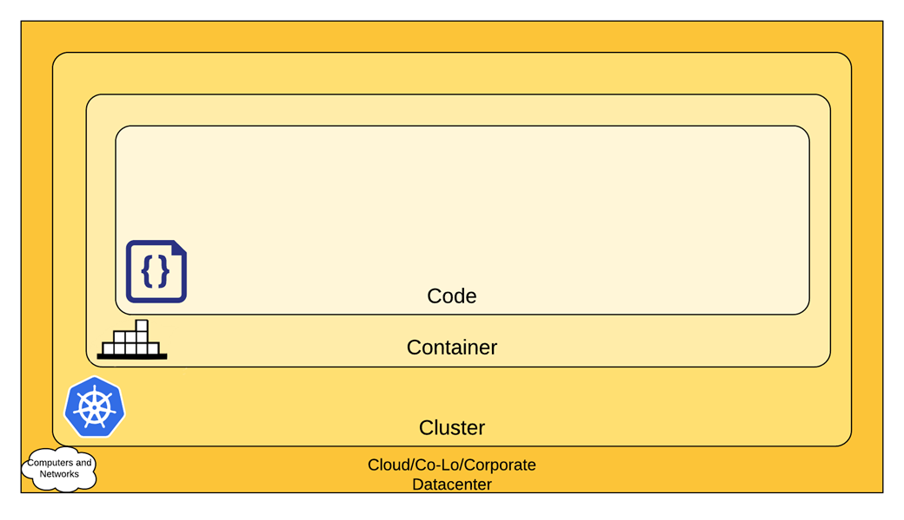
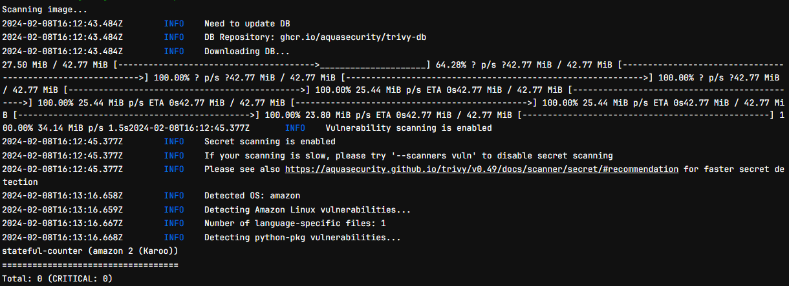
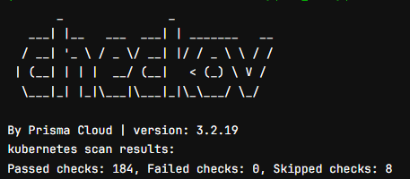
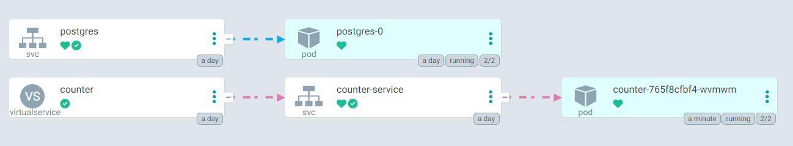
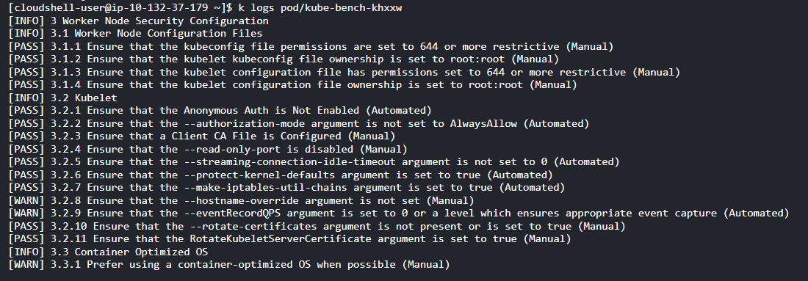

# Kubernetes-Deployment-2
DevSecOps processes are used to deploy an application to an EKS cluster.

## Cloud Native security:

https://kubernetes.io/docs/concepts/security/overview/

- This project integrates security at each layer: code, container, cluster, and cloud.
- The CI/CD pipeline for the deployment requires a vulnerability scan of the image container and security checks of the manifests before pushing to the main branch and deploying the application to the cluster.
- The containers are secured at the pod level through security contexts, network policies, and role based access control. 
- The cluster is secured by using audit logs to monitor the cluster with AWS GuardDuty for runtime security.
- The cloud enviroment is secured through security groups controlling network access to resources as well as an Istio service mesh to provide traffic management.

## Steps
- Configured VPC, Subnets, and Security Groups using Terraform
- Deployed EKS cluster using Terraform
- Created namespaces to isolate resources
- Installed Helm
    - https://helm.sh/ 
- Installed Helm chart for ArgoCD 
    - https://artifacthub.io/packages/helm/argo/argocd-apps/
- Installed Helm charts for the Istio 
    - https://artifacthub.io/packages/helm/istio-official/base
    - https://artifacthub.io/packages/helm/istio-official/istiod
    - https://artifacthub.io/packages/helm/istio-official/gateway
- Installed Helm chart for Cert Manager 
    - https://artifacthub.io/packages/helm/cert-manager/cert-manager
- Created CI pipeline using Gitlab with the following stages
    - build-image (build image from dockerfile and vulnerability scan for container image using Trivy)  
      
    - iac-scan (vulnerability scan for kubernetes manifests using Checkov)  
      
    - deploy-code (code is merged with the main branch)
    - deploy-app (argocd application file is applied to eks cluster)  
      
    - delete (option to delete application from eks cluster)
- Kube-bench runs security audit against CIS Kubernetes Benchmark  
  
